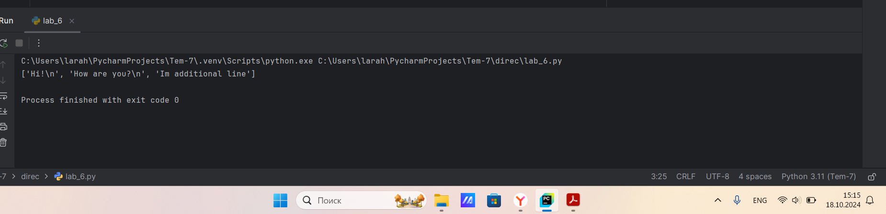
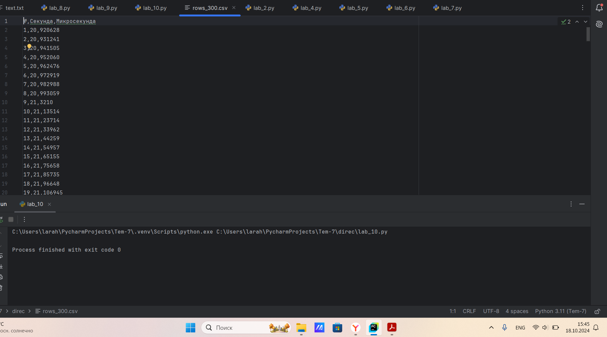
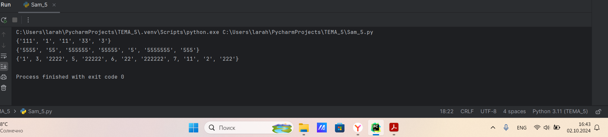

# Тема 3.Операторы, условия, циклы
Отчет по Теме #3 выполнил(а):
- Алексеенко Валерия Олеговна
- ИВТ-22-1

| Задание | Лаб_раб | Сам_раб |
| ------ | ------ | ------ |
| Задание 1 | + | + |
| Задание 2 | + | + |
| Задание 3 | + | + |
| Задание 4 | + | + |
| Задание 5 | + | + |
| Задание 6 | + |  |
| Задание 7 | + |  |
| Задание 8 | + |  |
| Задание 9 | + |  |
| Задание 10 | + |  |

знак "+" - задание выполнено; знак "-" - задание не выполнено;

Работу проверили:
- к.э.н., доцент Панов М.А.

## Лабораторная работа №1
### Создайте две переменные, значение которых будете вводить через консоль. Также составьте условие, в котором созданные ранее переменные будут сравниваться, если условие выполняется, то выведете в консоль «Выполняется», если нет, то «Не выполняется».

```python
num1 = int(input("Введите первое число: "))
num2 = int(input("Введите второе число: "))
if num1 > num2:
    print("Выполняется")
else:
    print("Не выполняется")
```
### Результат.


## Выводы

В данном коде с помощью цикла if и else сравниваются переменные num1 и num2 и выводится результат.

## Лабораторная работа №2
### Напишите программу, которая будет определять значения переменной меньше 0, больше 0 и меныше 10 или больше 10. Это нужно реализовать при помощи одной переменной, значение которой будет вводится через консоль. а также при помоши конструкций if elif, else.

```python
num = int(input("Введите число: "))
if num < 0:
    print("Переменная меньше 0")
elif 0 < num < 10:
    print("Переменная больше 0 и меньше 10")
else:
    print("Переменная больше 10")
```
### Результат.


## Выводы

В данном коде определяется диапазон значения переменной с помощью циклов: if, else, elif и выводится результат.

## Лабораторная работа №3
### Напишите программу, в которой будет проверяться есть ли переменная в указанном массиве используя логический оператор in Самостоятельно посмотрите, как работает программа со значениями которых нет в массиве numbers.

```python
arr = [1, 8, 9, 34, 5, 0]
num = int(input("Введите число: "))
if num in arr:
    print("Переменная есть в массиве")
else:
    print("Переменной нет в массиве")
```
### Результат.


## Выводы

В данном коде с помощью цикла for производится проверка переменной num, имеется ли она в массиве arr с помощью оператора in, далее выводится результат.

## Лабораторная работа №4
### Напишите программу, которая будет определять находится ли переменная в указанном массиве и если да, то проверьте четная она или нет. Самостоятельно протестируйте данную программу с разными значениями переменной value.

```python
arr = [1, 8, 9, 34, 5, 0]
num = int(input("Введите число: "))
if num in arr:
    if num % 2 == 0:
        print("Переменная четная и есть в массиве")
    else:
        print("Переменная нечетная и есть в массиве")
else:
    print("Переменной нет в массиве")
```
### Результат.


## Выводы

В данном коде производится проверка переменной num, имеется ли num в массиве arr, если имеется евляется ли она четной, или нечетной.  

## Лабораторная работа №5
### Напишите программу, в которой циклом for значения переменной і будут меняться от 0 до 10 и посмотрите, как разные виды сравнений и операций работают в цикле.

```python
for i in range(10):
    print("i = ", i)
    if i == 0:
        i -= 1
    if i == 8:
        continue
    if i == 4 or i == 5:
        print("i = ", i)
    elif i == 6:
        print("i = ", i)
    else:
        break
```
### Результат.


## Выводы

В данном коде с помощью цикла for проверяется как значения будут меняться от 0 до 10. Так же использованы циклы if, elif и else для того чтобы посмотреть как они будут работать в цикле.

## Лабораторная работа №6
### Напишите программу, в которой при помощи цикла for определяется есть ли переменная value в строке string и посмотрите, как работает оператор else для циклов. Самостоятельно посмотрите, что выведет программа, если значение переменной value оказалось в строке string. Определять индекс буквы не обязательно, но если вы хотите, то это делается при помощи строки: index = string.find(value) Bы берете название переменной, в которой вы хотите что-то найти, затем применяете встроенный метод find() и в нем указываете тo, что вам нужно найти. Данная строка вернет индекс искомого объекта.

```python
str = "Hello World!"
value = input("Введите букву: ")
for i in str:
    if i == value:
        index = str.find(value)
        print(f"Буква '{value}' присутсвует в строке под {index} индексом")
        break
    else:
        print(f"Буквы '{value}' нет в строке")
```
### Результат.


## Выводы

В данном коде при помощи цикла for определяется есть ли переменная value в строке string и используя if, else определяем индекс буквы и выводим результат.

## Лабораторная работа №7
### Напишите программу, в которой вы наглядно посмотрите, как работает цикл fог проходя в обратном порядке, то есть, к примеру не от 0 до 10, а от 10 уже готовой программе показано вычитание из 100, а вам во время реализации программы будет необходимо придумать свой вариант применения обратного цикла.

```python
num = 500
for i in range(7, -1, -1):
    num -= i
    print(i, num)
```
### Результат.


## Выводы

В данном коде можно посмортеть, как работает цикл for проходя в обратном порядке от 500.

## Лабораторная работа №8
### Напишите программу используя цикл while, внутри которого есть какие-либо проверки, но будьте осторожны, поскольку циклы while при неправильно написанных условиях могут становится бесконечными как указано в примере далее.

```python
num = 10
while num < 50:
    if num == 0:
        num += 10
    elif num // 5 > 1:
        num += 1
    else:
        num -= 2
    print(num)
```
### Результат.


## Выводы

В данном коде используя цикл while выводятся числа от 11 до 50, используя проверки if, elif, else.

## Лабораторная работа №9
### Напишите программу с использованием вложенных циклов и одной проверкой внутри них. Самое главное, не забудьте, что нельзя использовать одинаковые имена итерируемых переменных, когда вы используете вложенные циклы.

```python
num = 10
for i in range(10):
    for j in range(10):
        if i == j:
            num += j
        else:
            pass
print(num)
```
### Результат.


## Выводы

В данном коде с помощью вложенных циклов for и внутренних проверок if, else значение num будет увеличиваться только при i и j равны. Таким образом, num будет увеличиваться на 0, 1, 2, ..., 9. 
Итог:
0 + 1 + 2 + 3 + 4 + 5 + 6 + 7 + 8 + 9 = 45
Ответ:
10 + 45 = 55

## Лабораторная работа №10
### Напишите программу с использованием flag, которое будет определять есть ли нечетное число в массиве. В данной задаче flag выступает в роли индикатора встречи нечетного числа в исходном массиве, четных чисел.

```python
array = [1, 2, 3, 4, 5, 6, 7, 8, 9]
flag = False
for i in array:
    if i % 2 == 1:
        flag = True
if flag == True:
    print("В массиве есть нечетное число")
else:
    print("В массиве все числа четные")
```
### Результат.


## Выводы

В данном коде с помощью flag определяется присутсвует ли четные и нечетные числа в массиве.

## Самостоятельная работа №1
### Напишите программу, которая преобразует 1 в 31. Для выполнения поставленной задачи необходимо обязательно и только один раз использовать цикл for. *=5. +=1. Никаких других действий или циклов использовать нельзя. 

```python
num = 1
res = 31
for i in range(15):
    if num >= res:
        break
    num *= 5
    num += 1
print(num)
```
### Результат.


## Выводы

В данном коде происходит преобразование числа 1 в 31, с помощью цикла for, и внутреннего цикла if.

## Самостоятельная работа №2
### Напишите программу, которая фразу «Hello World» выводит в обратном порядке, и каждая буква находится в одной строке консоли.

```python
str = "Hello World"[::-1]
print(*str, sep='\n')
```
### Результат.


## Выводы

В данном коде с помощью функции sep происходит срез для обращения строки, чтобы вывести каждую букву на отдельной строке.

## Самостоятельная работа №3
### Напишите программу, на вход которой поступает значение из консоли, оно должно быть числовым и в диапазоне от 0 до 10 включительно (это необходимо учесть в программе). Если вводимое число не подходит по требованиям, то необходимо вывести оповещение об этом в консоль и остановить программу. Код должен вычислять в каком диапазоне находится полученное число. Нужно учитывать три диапазона: от 0 до З, включительно, от 3 до 6, от 6 до 10 включительно. Результатом работы программы будет выведенный в консоль диапазон. Программа должна занимать не более 10 строчек в редакторе кода.

```python
num = int(input("Введите число в диапазоне от 0 до 10: "))
if num >= 0 and num <= 10:
    if num >= 0 and num <= 3:
        print("от 0 до 3")
    elif num >= 3 and num <= 6:
        print("от 3 до 6")
    else:
        print("от 6 до 10")
```
### Результат.


## Выводы

В данном коде производится проверка числа, в каком диапазоне оно находится, используя циклы if, elif, else.

## Самостоятельная работа №4
### Манипулирование строками. Напишите программу на Python, которая принимает предложение (на английском) в качестве входных данных от пользователя. Выполните следующие операции и отобразите результаты: Выведите длину предложения. Переведите предложение в нижний регистр. Подсчитайте количество гласных (а, е, і, о, и) в предложении. Замените все слова "ugly" нa "beauty". Проверьте, начинается ли предложение с "Thе" и заканчивается ли на "end". Проверьте работу программы минимум на З предложениях, чтобы охватить проверку всех поставленных условий. 

```python
str = input("Введите предложение на английском:")

length = len(str)
print("Длина предложения:", length)

sentence = str.lower()
print("Предложение в нижнем регистре:", sentence)

vowels = 'aeiou'
count = 0
for char in sentence:
    if char in vowels:
       count += 1
print("Количество гласных в предложении:", count)

new_str= sentence.replace("ugly", "beauty")
print("Предложение с заменой слова 'ugly' на 'beauty':", new_str)

if sentence.startswith("the") and sentence.endswith("end"):
    print("Предложение начинается с 'The' и заканчивается на 'end'")
else:
    print("Предложение не начинается с 'The' и не заканчивается на 'end'")
```
### Результат.


## Выводы

В данном коде выводится длина предложения с помощью функции len(). Осуществлен перевод предложения в нижний регистр с помощью функции lower(). Подсчитано количество гласных (а, е, і, о, и) в предложении. Заменены все слова "ugly" нa "beauty" с помощью функции replace(). Осуществлена проверка, начинается ли предложение с "Thе" и заканчивается ли на "end"

## Самостоятельная работа №5
### Составьте программу, результатом которой будет данный вывод в консоль:

```python
string = 'hello'
memory = ' world'
counter = 0
values = [0, 2, 4, 6, 8, 10]
while counter != 10:
    if counter in values:
        print(string + memory)
    else:
        print(string)
    counter += 1
```
### Результат.


## Выводы

В данном коде  цикл while продолжается до тех пор, пока counter не станет равным 10. В условии if проверяется, находится ли текущее значение counter в списке values, если counter есть в списке values, выполняется print(string + memory), что выведет 'hello world', если counter не в списке values, выполняется print(string), что выведет просто 'hello'.

## Общие выводы по теме
В данной теме я изучила операторы, условия и циклы, которые являются основой программирования на Python. Они позволяют выполнять и создавать логически сложные программы, обрабатывать данные и управлять потоком выполнения, что является основным для написания кода.
