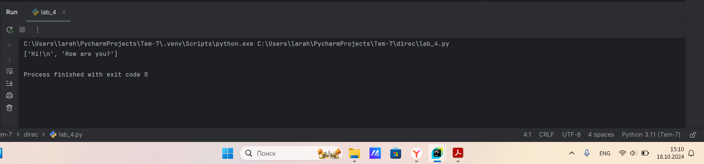

# Тема 3.Операторы, условия, циклы
Отчет по Теме #3 выполнил(а):
- Алексеенко Валерия Олеговна
- ИВТ-22-1

| Задание | Лаб_раб | Сам_раб |
| ------ | ------ | ------ |
| Задание 1 | + | + |
| Задание 2 | + | + |
| Задание 3 | + | + |
| Задание 4 | + | + |
| Задание 5 | + | + |
| Задание 6 | + |  |
| Задание 7 | + |  |
| Задание 8 | + |  |
| Задание 9 | + |  |
| Задание 10 | + |  |

знак "+" - задание выполнено; знак "-" - задание не выполнено;

Работу проверили:
- к.э.н., доцент Панов М.А.

## Лабораторная работа №1
### Выведите в консоль три строки. Первая – любое число. Вторая – любое число в виде строки. Третья – любое число с плавающей точкой.

```python
print(567)
print('567')
print(5.67)
```
### Результат.


## Выводы

В данном коде выводятся три строки с использованием функции `print()`. Каждая строка содержит разные значения:

1. `print(567)`: Выводится целое число 567. Это число не взаимодействует со строковыми операциями и выводится как есть.

2. `print('567')`: Выводится строка '567', так как она заключена в одинарные кавычки. В этом случае это текстовая строка, а не число.

3. `print(5.67)`: Выводится число с плавающей точкой 5.67. Так же, как и в первом случае, оно выводится как числовое значение.

## Лабораторная работа №2
### Выведите в консоль три строки. Первая результат сложения или вычитания минимум двух переменных типа int. Вторая результат сложения или вычитания минимум двух переменных типа foat. Третья — результат сложения или вычитания минимум двух переменных типа int и float.

```python
print(1289 + 342)
print(56.4 - 32.9)
print(78 + 9.4 - 13 + 2.8)
```
### Результат.


## Выводы

В данном коде выводятся три строки с использованием функции `print()`. Каждая строка содержит разные значения:
1. 'print(1289 + 342)': Выводится целое число, которе является результатом сложения двух переменных типа int.

2. 'print(56.4 - 32.9)': Выводится число с плавающей точкой, которое является результатом вычитания двух переменных типа float.

3. 'print(78 + 9.4 - 13 + 2.8)': Выводится число с плавающей точкой, которе является результатом сложения и вычитания двух пременных типа int и float.

## Лабораторная работа №3
### Выведите в консоль три строки. Первая — обычная строка. Вторая F строка с использованием заранее объявленной переменной. Третья сложите две или более строк в одну.

```python
print("Обычная строка")
F = "Строка"
print(f"Обычная {F}")
str1 = "Обычная"
str2 = "Строка"
print(str1 + str2)
```
### Результат.


## Выводы

В данном коде выводятся три строки с использованием функции `print()`. Каждая строка содержит разные значения:
1. 'print("Обычная строка")': Выводится обычная строка.

2. 'print(f"Обычная {F}")': Выводится строка с заранее объявленной переменной.

3. 'print(str1 + str2)': Выводится строка с заранее объявленными переменными, которые были сложены в одну строку.

## Лабораторная работа №4
### Выведите в консоль три строки. Первая — трансформация любого типа переменной в bool. Вторая - трансформация любого типа переменной в float или int. Третья - трансформация любого типа переменной в Str.

```python
str1 = 0
print(bool(str1))
str2 = 89
print(float(str2))
str3 = None
print(str(str3))
```
### Результат.


## Выводы

В данном коде выводятся три строки с использованием функции `print()`. Каждая строка содержит разные значения:
1. 'print(bool(str1))': Выводится конвертация из обычного типа переменной int в тип переменной bool.

2. 'print(float(str2))': Выводится конвертация из обычного типа переменной int в тип переменной float.

3. 'print(str1 + str2)': Выводится конвертация из None тип переменной str.

## Лабораторная работа №5
### Присвойте трем переменным различные значения, воспользовавшись функцией input()

```python
str1 = input("Строка 1: ")
str2 = input("Строка 2: ")
str3 = input("Строка 3: ")
print(str1, str2, str3)
```
### Результат.


## Выводы

В данном коде выводится одна строка с использованием функции `print()`.
1. 'str1 = input("Строка 1: ")': Присваиваем переменной str1 значение с помощью функции input(), и так делаем еще 2 раза.

2. 'print(str1, str2, str3)': Выводим на консоль три значения трех переменных.

## Лабораторная работа №6
### Создайте две любые числовые переменные и выполните над ними несколько математических операций: возведение в степень, обычное деление, целочисленное деление, нахождение остатка от деления. При желании вы можете проверить как работают эти вычисления разными типами данных, например, сначала создать две переменные int, затем создать две переменные foat и наконец создать переменные типа int и float и провести над ними операции, прописанные выше.

```python
one = 158
two = 22
print(one ** two)
print(one/two)
print(one//two)
print(one%two)
```
### Результат.


## Выводы

В данном коде выводятся четыре строки с использованием функции `print()`. Каждая строка содержит разные значения:
1. 'print(one ** two)': Выводится возведение в степень числовой переменной one типа int в числовую переменную two типа int.

2. 'print(one/two)': Выводится обычное деление числовой переменной one типа int на числовую переменную two типа int.

3. 'print(one//two)': Выводится целочисленное деление числовой переменной one типа int на числовую переменную two типа int.

4. 'print(one%two)': Выводится нахождение остатка от деления числовой переменной one типа int на числовую переменную two типа int.

## Лабораторная работа №7
### Создайте любую строковую переменную и произведите над ней математическое действие умножение на любое число.

```python
str = "Строка"
print(str * 4)
```
### Результат.


## Выводы

В данном коде выводится одна строка с использованием функции `print()`. 

'print(str * 4)': Выводится четыре раза слово Строка, из-за умножения на 4 переменной str

## Лабораторная работа №8
### Посчитайте сколько раз символ 'о' встречается в строке Hello World.

```python
str = "Hello World"
print(str.count("o"))
```
### Результат.


## Выводы

В данном коде выводится строка с использованием функции `print()`.
'print(str.count("o"))': Выводится количество символов 'o' за счет использования функции count().

## Лабораторная работа №9
### Напишите предложение 'Hello World' в две строки. Написанная программа должна занимать одну строку в редакторе кода.

```python
print('Hello\nWorld')
```
### Результат.


## Выводы

В данном коде выводится строка с использованием функции `print()`.
'print('Hello\nWorld')': Выводится предложение 'Hello World' в две строки с помощью символа новой строки - \n

## Лабораторная работа №10
### Из предложения Hello World: выведите в консоль только 2 символ, а затем выведите слово Hello.

```python
str = "Hello World"
print(str[1])
print(str[:5])
```
### Результат.


## Выводы

В данном коде выводятся две строки с использованием функции `print()`. Каждая строка содержит разные значения:
1. 'print(str[1])': Выводится второй символ переменной str.

2. 'print(str[:5])': Выводится слово Hello.

## Самостоятельная работа №1
### Выведите в консоль булевую переменную False, не используя слово False в строке или изначально присвоенную булевую переменную. Программа должна занимать не более двух строк редактора кода. 

```python
print(0 == 1)
```
### Результат.


## Выводы

В данном коде выводится строка с использованием функции `print()`.

`print(0 == 1)`: Выводится False, потому что происходит сравнение чисел 0 и 1, так как 0 не равен 1 выводится False.

## Самостоятельная работа №2
### Присвоить значения трем переменным и вывести их в консоль, используя только две строки редактора кода

```python
a = b = c = 2
print(a, b, c)
```
### Результат.


## Выводы

В данном коде выводится строка с использованием функции `print()`.
1. 'a = b = c = 2': Инициализируем переменные и присваиваем им значение 2.

2. 'print(a, b, c)': Выводим значения переменных.

## Самостоятельная работа №3
###  Реализуйте ввод данных в программу, через консоль, в виде только целых чисел (тип данных int). То есть при вводе буквенных символов в консоль, программа не должна работать. Программа должна занимать не более двух строк редактора кода.
```python
number = int(input("Введите целое число: "))
print(number)
```
### Результат.


## Выводы

В данном коде выводится строка с использованием функции `print()`.
1. 'number = int(input("Введите целое число: "))': Вводятся данные через консоль, если число не типа int, то программа не работает

2. 'print(number)': Вывод числа.

## Самостоятельная работа №4
### Создайте только одну строковую переменную. Длина строки должна не превышать 5 символов. На выходе мы должны получить строку длиной не менее 16 символов. Программа должна занимать не более двух строк редактора кода. 

```python
str = "abcd"
print(str * 4)
```
### Результат.


## Выводы

В данном коде выводится с использованием функции `print()`.

'print(str * 4)': Выводится строка умноженная на 4, на выходе получается строка из 16 символов.

## Самостоятельная работа №5
### Создайте три переменные: день (тип данных - числовой), месяц (тип данных - строка), год (тип данных - числовой) и выведите в консоль текущую дату в формате: “Сегодня день месяц год. Всего хорошего!” используя F строку и оператор end внутри print(), в котором вы должны написать фразу “Всего хорошего!». Программа должна занимать не более двух строк редактора кода.
```python
day, month, year = 11, "сентября", 2024
print(f"Сегодня {day} {month} {year}.",  end=" Всего хорошего!")
```
### Результат.


## Выводы

В данном коде выводится одна строка с использованием функции `print()`.
1. 'print(f"Сегодня {day} {month} {year}.", " Всего хорошего!")': Выводится дата в формате “Сегодня день месяц год. Всего хорошего!”. Используя F строку и оператор end внутри print().

## Общие выводы по теме
В данной теме я изучила базовые операции работы с python. Они позволяют выполнять математические вычисления, сравнения и логические проверки, что является основным для написания кода.
