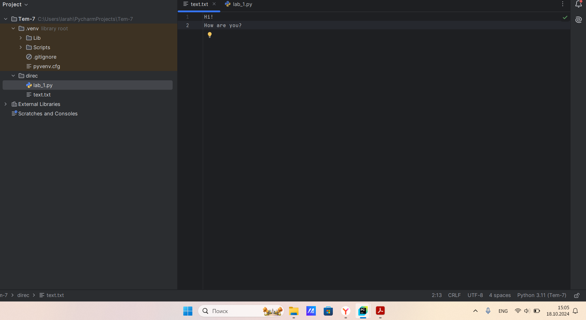

# Тема 4. Функции и стандартные модули/библиотеки
Отчет по Теме #4 выполнил(а):
- Алексеенко Валерия Олеговна
- ИВТ-22-1

| Задание | Лаб_раб | Сам_раб |
| ------ | ------ | ------ |
| Задание 1 | + | + |
| Задание 2 | + | + |
| Задание 3 | + | + |
| Задание 4 | + | + |
| Задание 5 | + | + |
| Задание 6 | + |  |
| Задание 7 | + |  |
| Задание 8 | + |  |
| Задание 9 | + |  |
| Задание 10 | + |  |

знак "+" - задание выполнено; знак "-" - задание не выполнено;

Работу проверили:
- к.э.н., доцент Панов М.А.

## Лабораторная работа №1
### Напишите функцию, которая выполняет любые арифметические  действия и выводит результат  B консолЬ. Вызовите функцию используя  «точку входа’.

```python
def function(a, b):
    print (a*b)

function(101, 54)
```
### Результат.


## Выводы

В данном коде функция calculate принимает два числа и операцию, которую нужно выполнить. Вызов функции с параметрами 101, 54 и операцией 'multiply' выведет результат умножения этих чисел.

## Лабораторная работа №2
### Напишите функцию, которая выполняет любые арифметические  действия, возвращает при помощи retum значение в место, откуда  вызывали функцию. Выведите результат в консоль. Вызовите функцию  используя “точку входа’.

```python
def function(a, b):
    return a/b
result = function(2048, 4)
print(result)
```
### Результат.


## Выводы

В данном коде функция calculate принимает два числа и операцию, которую нужно выполнить. Вызов функции с параметрами 2048, 4 и операцией 'деленение' вернет результат деления этих чисел, который затем будет выведен в консоль.

## Лабораторная работа №3
### Напишите функцию, в которую передаются два аргумента, над ними  производится арифметическое действие, результат возвращается туда,  откуда эту функцию вызывали. Выведите результат в консоль  Вызовите функцию в любом небольшом цикле.

```python
def function(a, b):
    result = a*b
    return result

for i in range(5):
    a = 2
    b = 3
    result = function(a, b)
    print(result)
```
### Результат.


## Выводы

В данном коде функция function принимает два числа и операцию, которую нужно выполнить. Вызов функции с параметрами 2, 3 и операцией 'умножение' вернет результат этих чисел, который затем будет выведен в консоль 5 раз.

## Лабораторная работа №4
### Напишите функцию, на вход которой подается какое-то изначальное  неизвестное количество аргументов, над которыми будет производится  арифметические действия. Для выполнения задания необходимо  использовать кортеж “*args”.

```python
def function(*args):
    sum = 0
    for i in args:
        sum += i
    print(sum)
nums = (-1, 9, 0, 11, 23, 5, -6)
function(*nums)
```
### Результат.


## Выводы

В данном коде функция function принимает какое то количество аргументов, и находит сумму этих элементов с помощью кортежа “*args”.  

## Лабораторная работа №5
### Напишите функцию, которая на вход получает кортеж “**kwargs” и  при помощи цикла выводит значения, поступившие в функцию. Вызовите функцию используя “точку входа”

```python
def function(**kwargs):
    for i in kwargs.items():
        print(i)
if __name__ == '__main__':
    function(n1 = 1, n2 = 'main', n3 = [1,2,3,4])
```
### Результат.


## Выводы

В данном коде **kwargs позволяет функции принимать произвольное количество именованных аргументов. for i in kwargs.items(): мы используем метод .items(), который возвращает пары из словаря kwargs. Переменная i в цикле будет принимать значения этих пар. print(i) — выводит каждую пару (ключ, значение) на экран.

## Лабораторная работа №6
### Напишите две функции. Первая — получает в виде параметра  **kwargs”. Вторая считает среднее арифметическое из значений  первой функции. Вызовите первую функцию используя “точку входа’  и минимум 4 аргумента.

```python
def function(**kwargs):
    for i, j in kwargs.items():
        print(f"{i}. Среднее арифмитическое = {mean(j)}")
def mean(nums):
    return sum(nums) / float(len(nums))
if __name__ == "__main__":
    function(n1 = [13, 6, 9], n2 = [4, 89, 1])
```
### Результат.


## Выводы

В данном коде можно рассчитать и вывести средние арифметические значения для произвольного количества групп чисел, передавая их в функции в виде именованных аргументов.

## Лабораторная работа №7
### Создайте дополнительный файл .ру. Напишите в нем любую функцию, которая будет что угодно выводить в консоль, но не вызывайте ее в нем. Откройте файл mаiп.ру, импортируйте в него функцию из нового  файла и при помощи “точки входа” вызовите эту функцию.

```python
def newFactorial():
    print("Factorial")
from lab_7 import newFactorial
if __name__ == '__main__':
    newFactorial()
```
### Результат.


## Выводы

В данном коде используются два файла, в первом файле написана сама функция, а во втором файле идет импорт функции и ее вызов.

## Лабораторная работа №8
### Напишите программу, которая будет выводить корень, синус, косинус  полученного  пользователя числа.

```python
import math
def factorial():
    num = int(input("Enter a number: "))
    print(math.sqrt(num))
    print(math.sin(num))
    print(math.cos(num))

factorial()
```
### Результат.


## Выводы

В данном коде функция function принимает значение и выводит корень, синус, косинус.

## Лабораторная работа №9
### Напишите программу, которая будет рассчитывать какой день недели  будет через n-нное количество дней, которые укажет пользователь.

```python
from datetime import datetime
def factorial(daysOfWeek):
    days = ["Понедельник", "Вторник", "Среда", "Четверг", "Пятница", "Суббота", "Воскресенье"]
    nowDay = datetime.now().weekday()
    day = (nowDay + daysOfWeek) % 7
    return days[day]
if __name__ == "__main__":
    days = int(input("Введите количество дней: "))
    result = factorial(days)
    print(f"Через {days} дня будет: {result}")
```
### Результат.


## Выводы

Код начинает с импорта модуля datetime, который позволяет работать с датой и временем. Функция factorial принимает параметр daysOfWeek, который представляет количество дней, прибавляемых к текущему дню недели. nowDay = datetime.now().weekday() получает номер текущего дня недели (где 0 — понедельник, 6 — воскресенье). Таким образом данный код позволяет пользователю определить, какой день недели наступит через определённое число дней, начиная с текущего дня.

## Лабораторная работа №10
### Напишите программу с использованием глобальных переменных  которая будет  считать площадь треугольника или прямоугольника B  зависимости  того, что выберет пользователь. Получение всей  необходимой информации реализовать через inpиt0), а подсчет  плошадей выполнить при помоши функций. Результатом программы  будет число, равное плошади, необходимой фигуры..

```python
global result
def rectangle():
    a = float(input("Ширина:"))
    b = float(input("Высота:"))
    global result
    result = a * b
def triangle():
    a = float(input("Основание:"))
    h = float(input("Высота:"))
    global result
    result = 0.5 * a * h
figure = input("1-прямоугольник, 2-треугольник: ")
if figure == "1":
    rectangle()
elif figure == "2":
    triangle()
print(result)
```
### Результат.


## Выводы

В данном коде программа с использованием глобальных переменных,  которая считает площадь треугольника или прямоугольника. B  зависимости  того, что выберет пользователь. Получение всей  необходимой информации реализовать через inpиt(), а подсчет  плошадей выполнить при помоши функций rectangle(), triangle(). Результатом программы  будет число, равное плошади, необходимой фигуры..

## Самостоятельная работа №1
### Дайте подробный комментарий для кода, написанного ниже. Комментарий нужен для каждой строчки кода, нужно описать что она  делает. Не забудьте, что функции комментируются по-особенному. 

```python
# Импортируем класс datetime из модуля datetime для работы с датой и временем
from datetime import datetime
# Импортируем функцию sqrt из модуля math для вычисления квадратного корня
from math import sqrt
# Определяем функцию main, которая принимает произвольное количество именованных аргументов (kwargs)
def main(**kwargs):
    # Итерируемся по элементам kwargs, где key - это имя аргумента, а value - его значение
    for key in kwargs.items():
        # Вычисляем расстояние от начала координат до точки, заданной значениями из kwargs,
        # используя теорему Пифагора (sqrt(x^2 + y^2))
        result = sqrt(key[1][0] ** 2 + key[1][1] ** 2)
        # Выводим результат вычисления на экран
        print(result)
    # Проверяем, что данный файл запускается как основная программа
if __name__ == '__main__':
    # Запоминаем текущее время перед началом выполнения функции main
    start_time = datetime.now()
    # Вызываем функцию main с набором значений, каждый из которых представляет координаты точки
    main(
        one=[10, 3],
        two=[5, 4],
        three=[15, 13],
        four=[93, 53],
        five=[133, 15]
    )
    # Вычисляем время выполнения программы, вычитая начальное время из текущего времени
    time_costs = datetime.now() - start_time
    # Выводим время выполнения программы на экран
    print(f"Время выполнения программы - {time_costs}")
```
### Результат.


## Выводы

Данный код позволяет вычислять и выводить расстояние до нескольких заданных точек на плоскости, а также время, затраченное на выполнение этих вычисл.

## Самостоятельная работа №2
### Напишите программу, которая будет заменять игральную кость с 6  гранями. Если значение равно 5 или 6, то в консоль выводится «Вы  победили», если значения З или 4, то вы рекурсивно должны вызвать  эту же функцию, если значение 1 или 2, то в консоль выводится «Вы  проиграли». При этом каждый вызов функции необходимо выводить в  консоль значение “кубика”. Для выполнения задания необходимо  использовать стандартную библиотеку random. Программу нужно  написать, используя одну функцию и “точку входа’.

```python
import random
def function():
    value = random.randint(1, 6)
    print(f"Кубик: {value}")
    if value == 5 or value == 6:
        print("Вы победили")
    elif value == 3 or value == 4:
        function()
    else:
        print("Вы проиграли")
if __name__ == '__main__':
    function()
```
### Результат.


## Выводы

В данном коде с помощью функции function() заменяется игральная кость с 6 гранями. Если значение равно 5 или 6, то в консоль выводится «Вы  победили», если значения З или 4, то рекурсивно вызывается  функция, если значение 1 или 2, то в консоль выводится «Вы  проиграли».

## Самостоятельная работа №3
### Напишите программу, которая будет выводить текущее время, с  точностью до секунд на протяжении 5 секунд. Программу нужно  написать с использованием цикла. Подсказка: необходимо  использовать модуль datetime u time, а также вам необходимо как-то  “усыплять” программу на 1 секунду

```python
import datetime
import time
def function():
    for _ in range(5):
        nowTime = datetime.datetime.now()
        print(nowTime.strftime("%H:%M:%S"))
        time.sleep(1)
if __name__ == '__main__':
    function()
```
### Результат.


## Выводы

В данном коде выводится текущее время в течении 5 секунд с помощью импортированных модулей datetime u time.

## Самостоятельная работа №4
### Напишите программу, которая считает среднее арифметическое от  аргументов вызываемое функции, с условием того, что изначальное  количество этих аргументов неизвестно. Программу необходимо  реализовать используя одну функцию и “точку входа”. 

```python
def function(*args):
    if len(args) == 0:
        return 0
    total = sum(args)
    average = total / len(args)
    return average

if __name__ == '__main__':
    result = function(10, 20, 30, 40, 50)
    print(f"Среднее арифметическое: {result}")
```
### Результат.


## Выводы

В данном коде функция function считывает среднее арифметическое от аргументов с помощью *args.

## Самостоятельная работа №5
### Создайте два Python файла, в одном будет выполняться вычисление  площади треугольника при помощи формулы Герона (необходимо  реализовать через функцию), а во втором будет происходить  взаимодействие с пользователем (получение всей необходимой  информации и вывод результатов). Напишите эту программу и  выведите в консоль полученную плошадь

```python
import math

def function(a, b, c):
    if a + b <= c or a + c <= b or b + c <= a:
        return 0
    else:
        s = (a + b + c) / 2
        result = math.sqrt(s * (s - a) * (s - b) * (s - c))
        return result
from Sam_5 import function
print("Введите длины сторон треугольника (a, b, c):")
a = float(input("Сторона a: "))
b = float(input("Сторона b: "))
c = float(input("Сторона c: "))
result = function(a, b, c)
print(result)
```
### Результат.


## Выводы

В данном коде имеется два Python файла, в одном выполняется вычисление  площади треугольника при помощи формулы Герона, а во втором идет взаимодействие с пользователем для получения сторон треугольника. 

## Общие выводы по теме
В данной теме я изучила Функции и стандартные модули/библиотеки, которые являются основой программирования на Python. Они позволяют выполнять и создавать логически сложные программы, обрабатывать данные и управлять потоком выполнения, что является основным для написания кода.
