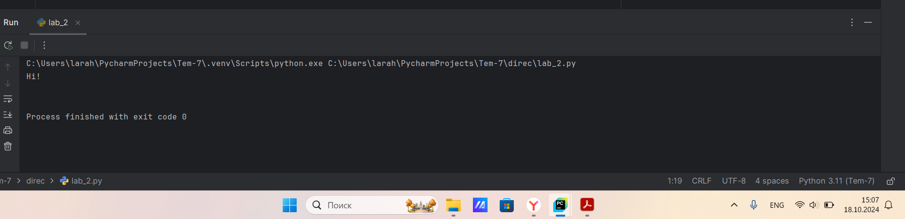

# Тема 4. Функции и стандартные модули/библиотеки
Отчет по Теме #4 выполнил(а):
- Алексеенко Валерия Олеговна
- ИВТ-22-1

| Задание | Лаб_раб | Сам_раб |
| ------ | ------ | ------ |
| Задание 1 | + | + |
| Задание 2 | + | + |
| Задание 3 | + | + |
| Задание 4 | + | + |
| Задание 5 | + | + |
| Задание 6 | + |  |
| Задание 7 | + |  |
| Задание 8 | + |  |
| Задание 9 | + |  |
| Задание 10 | + |  |

знак "+" - задание выполнено; знак "-" - задание не выполнено;

Работу проверили:
- к.э.н., доцент Панов М.А.

## Лабораторная работа №1
### Напишите функцию, которая выполняет любые арифметические  действия и выводит результат  B консолЬ. Вызовите функцию используя  «точку входа’.

```python
def function(a, b):
    print (a*b)

function(101, 54)
```
### Результат.


## Выводы

В данном коде функция calculate принимает два числа и операцию, которую нужно выполнить. Вызов функции с параметрами 101, 54 и операцией 'multiply' выведет результат умножения этих чисел.

## Лабораторная работа №2
### Напишите функцию, которая выполняет любые арифметические  действия, возвращает при помощи retum значение в место, откуда  вызывали функцию. Выведите результат в консоль. Вызовите функцию  используя “точку входа’.

```python
def function(a, b):
    return a/b
result = function(2048, 4)
print(result)
```
### Результат.


## Выводы

В данном коде функция calculate принимает два числа и операцию, которую нужно выполнить. Вызов функции с параметрами 2048, 4 и операцией 'деленение' вернет результат деления этих чисел, который затем будет выведен в консоль.

## Лабораторная работа №3
### Напишите функцию, в которую передаются два аргумента, над ними  производится арифметическое действие, результат возвращается туда,  откуда эту функцию вызывали. Выведите результат в консоль  Вызовите функцию в любом небольшом цикле.

```python
def function(a, b):
    result = a*b
    return result

for i in range(5):
    a = 2
    b = 3
    result = function(a, b)
    print(result)
```
### Результат.


## Выводы

В данном коде функция function принимает два числа и операцию, которую нужно выполнить. Вызов функции с параметрами 2, 3 и операцией 'умножение' вернет результат этих чисел, который затем будет выведен в консоль 5 раз.

## Лабораторная работа №4
### Напишите функцию, на вход которой подается какое-то изначальное  неизвестное количество аргументов, над которыми будет производится  арифметические действия. Для выполнения задания необходимо  использовать кортеж “*args”.

```python
def function(*args):
    sum = 0
    for i in args:
        sum += i
    print(sum)
nums = (-1, 9, 0, 11, 23, 5, -6)
function(*nums)
```
### Результат.


## Выводы

В данном коде функция function принимает какое то количество аргументов, и находит сумму этих элементов с помощью кортежа “*args”.  

## Лабораторная работа №5
### Напишите функцию, которая на вход получает кортеж “**kwargs” и  при помощи цикла выводит значения, поступившие в функцию. Вызовите функцию используя “точку входа”

```python
def function(**kwargs):
    for i in kwargs.items():
        print(i)
if __name__ == '__main__':
    function(n1 = 1, n2 = 'main', n3 = [1,2,3,4])
```
### Результат.


## Выводы

В данном коде **kwargs позволяет функции принимать произвольное количество именованных аргументов. for i in kwargs.items(): мы используем метод .items(), который возвращает пары из словаря kwargs. Переменная i в цикле будет принимать значения этих пар. print(i) — выводит каждую пару (ключ, значение) на экран.

## Лабораторная работа №6
### Напишите две функции. Первая — получает в виде параметра  **kwargs”. Вторая считает среднее арифметическое из значений  первой функции. Вызовите первую функцию используя “точку входа’  и минимум 4 аргумента.

```python
def function(**kwargs):
    for i, j in kwargs.items():
        print(f"{i}. Среднее арифмитическое = {mean(j)}")
def mean(nums):
    return sum(nums) / float(len(nums))
if __name__ == "__main__":
    function(n1 = [13, 6, 9], n2 = [4, 89, 1])
```
### Результат.


## Выводы

В данном коде можно рассчитать и вывести средние арифметические значения для произвольного количества групп чисел, передавая их в функции в виде именованных аргументов.

## Лабораторная работа №7
### Создайте дополнительный файл .ру. Напишите в нем любую функцию, которая будет что угодно выводить в консоль, но не вызывайте ее в нем. Откройте файл mаiп.ру, импортируйте в него функцию из нового  файла и при помощи “точки входа” вызовите эту функцию.

```python
def newFactorial():
    print("Factorial")
from lab_7 import newFactorial
if __name__ == '__main__':
    newFactorial()
```
### Результат.


## Выводы

В данном коде используются два файла, в первом файле написана сама функция, а во втором файле идет импорт функции и ее вызов.

## Лабораторная работа №8
### Напишите программу, которая будет выводить корень, синус, косинус  полученного  пользователя числа.

```python
import math
def factorial():
    num = int(input("Enter a number: "))
    print(math.sqrt(num))
    print(math.sin(num))
    print(math.cos(num))

factorial()
```
### Результат.


## Выводы

В данном коде функция function принимает значение и выводит корень, синус, косинус.

## Лабораторная работа №9
### Напишите программу, которая будет рассчитывать какой день недели  будет через n-нное количество дней, которые укажет пользователь.

```python
from datetime import datetime
def factorial(daysOfWeek):
    days = ["Понедельник", "Вторник", "Среда", "Четверг", "Пятница", "Суббота", "Воскресенье"]
    nowDay = datetime.now().weekday()
    day = (nowDay + daysOfWeek) % 7
    return days[day]
if __name__ == "__main__":
    days = int(input("Введите количество дней: "))
    result = factorial(days)
    print(f"Через {days} дня будет: {result}")
```
### Результат.


## Выводы

Код начинает с импорта модуля datetime, который позволяет работать с датой и временем. Функция factorial принимает параметр daysOfWeek, который представляет количество дней, прибавляемых к текущему дню недели. nowDay = datetime.now().weekday() получает номер текущего дня недели (где 0 — понедельник, 6 — воскресенье). Таким образом данный код позволяет пользователю определить, какой день недели наступит через определённое число дней, начиная с текущего дня.

## Лабораторная работа №10
### Напишите программу с использованием глобальных переменных  которая будет  считать площадь треугольника или прямоугольника B  зависимости  того, что выберет пользователь. Получение всей  необходимой информации реализовать через inpиt0), а подсчет  плошадей выполнить при помоши функций. Результатом программы  будет число, равное плошади, необходимой фигуры..

```python
global result
def rectangle():
    a = float(input("Ширина:"))
    b = float(input("Высота:"))
    global result
    result = a * b
def triangle():
    a = float(input("Основание:"))
    h = float(input("Высота:"))
    global result
    result = 0.5 * a * h
figure = input("1-прямоугольник, 2-треугольник: ")
if figure == "1":
    rectangle()
elif figure == "2":
    triangle()
print(result)
```
### Результат.


## Выводы

В данном коде программа с использованием глобальных переменных,  которая считает площадь треугольника или прямоугольника. B  зависимости  того, что выберет пользователь. Получение всей  необходимой информации реализовать через inpиt(), а подсчет  плошадей выполнить при помоши функций rectangle(), triangle(). Результатом программы  будет число, равное плошади, необходимой фигуры..

## Самостоятельная работа №1
### Напишите программу, которая преобразует 1 в 31. Для выполнения поставленной задачи необходимо обязательно и только один раз использовать цикл for. *=5. +=1. Никаких других действий или циклов использовать нельзя. 

```python
num = 1
res = 31
for i in range(15):
    if num >= res:
        break
    num *= 5
    num += 1
print(num)
```
### Результат.


## Выводы

В данном коде происходит преобразование числа 1 в 31, с помощью цикла for, и внутреннего цикла if.

## Самостоятельная работа №2
### Напишите программу, которая фразу «Hello World» выводит в обратном порядке, и каждая буква находится в одной строке консоли.

```python
str = "Hello World"[::-1]
print(*str, sep='\n')
```
### Результат.


## Выводы

В данном коде с помощью функции sep происходит срез для обращения строки, чтобы вывести каждую букву на отдельной строке.

## Самостоятельная работа №3
### Напишите программу, на вход которой поступает значение из консоли, оно должно быть числовым и в диапазоне от 0 до 10 включительно (это необходимо учесть в программе). Если вводимое число не подходит по требованиям, то необходимо вывести оповещение об этом в консоль и остановить программу. Код должен вычислять в каком диапазоне находится полученное число. Нужно учитывать три диапазона: от 0 до З, включительно, от 3 до 6, от 6 до 10 включительно. Результатом работы программы будет выведенный в консоль диапазон. Программа должна занимать не более 10 строчек в редакторе кода.

```python
num = int(input("Введите число в диапазоне от 0 до 10: "))
if num >= 0 and num <= 10:
    if num >= 0 and num <= 3:
        print("от 0 до 3")
    elif num >= 3 and num <= 6:
        print("от 3 до 6")
    else:
        print("от 6 до 10")
```
### Результат.


## Выводы

В данном коде производится проверка числа, в каком диапазоне оно находится, используя циклы if, elif, else.

## Самостоятельная работа №4
### Манипулирование строками. Напишите программу на Python, которая принимает предложение (на английском) в качестве входных данных от пользователя. Выполните следующие операции и отобразите результаты: Выведите длину предложения. Переведите предложение в нижний регистр. Подсчитайте количество гласных (а, е, і, о, и) в предложении. Замените все слова "ugly" нa "beauty". Проверьте, начинается ли предложение с "Thе" и заканчивается ли на "end". Проверьте работу программы минимум на З предложениях, чтобы охватить проверку всех поставленных условий. 

```python
str = input("Введите предложение на английском:")

length = len(str)
print("Длина предложения:", length)

sentence = str.lower()
print("Предложение в нижнем регистре:", sentence)

vowels = 'aeiou'
count = 0
for char in sentence:
    if char in vowels:
       count += 1
print("Количество гласных в предложении:", count)

new_str= sentence.replace("ugly", "beauty")
print("Предложение с заменой слова 'ugly' на 'beauty':", new_str)

if sentence.startswith("the") and sentence.endswith("end"):
    print("Предложение начинается с 'The' и заканчивается на 'end'")
else:
    print("Предложение не начинается с 'The' и не заканчивается на 'end'")
```
### Результат.


## Выводы

В данном коде выводится длина предложения с помощью функции len(). Осуществлен перевод предложения в нижний регистр с помощью функции lower(). Подсчитано количество гласных (а, е, і, о, и) в предложении. Заменены все слова "ugly" нa "beauty" с помощью функции replace(). Осуществлена проверка, начинается ли предложение с "Thе" и заканчивается ли на "end"

## Самостоятельная работа №5
### Составьте программу, результатом которой будет данный вывод в консоль:

```python
string = 'hello'
memory = ' world'
counter = 0
values = [0, 2, 4, 6, 8, 10]
while counter != 10:
    if counter in values:
        print(string + memory)
    else:
        print(string)
    counter += 1
```
### Результат.


## Выводы

В данном коде  цикл while продолжается до тех пор, пока counter не станет равным 10. В условии if проверяется, находится ли текущее значение counter в списке values, если counter есть в списке values, выполняется print(string + memory), что выведет 'hello world', если counter не в списке values, выполняется print(string), что выведет просто 'hello'.

## Общие выводы по теме
В данной теме я изучила операторы, условия и циклы, которые являются основой программирования на Python. Они позволяют выполнять и создавать логически сложные программы, обрабатывать данные и управлять потоком выполнения, что является основным для написания кода.
