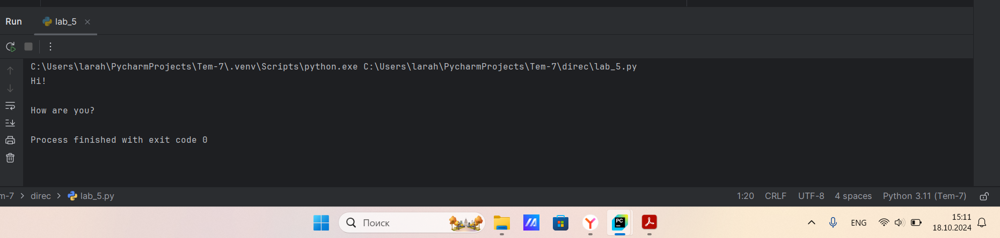
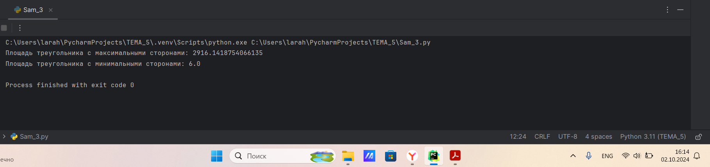

# Тема 6. Базовые коллекции: словари, кортежи
Отчет по Теме #6 выполнил(а):
- Алексеенко Валерия Олеговна
- ИВТ-22-1

| Задание | Лаб_раб | Сам_раб |
| ------ | ------ | ------ |
| Задание 1 | + | + |
| Задание 2 | + | + |
| Задание 3 | + | + |
| Задание 4 | + | + |
| Задание 5 | + | + |
| Задание 6 |  |  |
| Задание 7 |  |  |
| Задание 8 |  |  |
| Задание 9 |  |  |
| Задание 10 |  |  |

знак "+" - задание выполнено; знак "-" - задание не выполнено;

Работу проверили:
- к.э.н., доцент Панов М.А.

## Лабораторная работа №1
### В школе, где вы учились, узнали, что вы крутой программист и  попросили написать программу для учителей, которая будет при вводе  кабинета писать для него ключ доступа и статус, занят кабинет или нет При написании программы необходимо использовать словарь (dict),  который на вход получает номер кабинета, а выводит необходимую  информацию. Если кабинета, который вы ввели нет в словаре, то в  консоль в виде значения ключа нужно вывести “None” и виде статуса  вывести “False”  По большому счету написав данную программу мы с вами научились  заменять иногда громоздкую конструкцию ifeliflelse. Поскольку здесь  функционал словаря полностью повторяет функционал условия, но при  этом у использования словарей в более сложных программах есть  намного больше возможностей реализации.

```python
cabinet = int(input('Введите номер кабинета: '))
distionary = {
    101: {'key': 1234, 'access': True},
    102: {'key': 1345, 'access': True},
    103: {'key': 3567, 'access': False},
    104: {'key': 8421, 'access': False},
    None: {'key': None, 'access': False}
}
response = distionary.get(cabinet)
if not response:
    response = distionary[None]
key = response.get('key')
access = response.get('access')
print(key, access)
```
### Результат.


## Выводы

В данном коде на вход подается номер кабинета, и выводит ключ доступа и статус. Если кабинета, который вы ввели нет в словаре, то в  консоли выводится значение ключа “False”.

## Лабораторная работа №2
### Алексей решил создать самый большой словарь в мире. Для этого он  придумал функцию dict_maker (**kwargs), которая принимает  неограниченное количество параметров «ключ: значение» и обновляет  созданный им словарь my_dict, состоящий всего из одного элемента  «first» со значением «so easy». Помогите Алексею создать данную функцию.

```python
from pprint import pprint
my_dist = {'first': 'so easy'}
def dist_maker(**kwargs):
    my_dist.update(**kwargs)
dist_maker(name='Ксения', age=20, weight=50, eyes_color='blue')
pprint(my_dist)
```
### Результат.


## Выводы

В данном коде с создается функция dict_maker (**kwargs), которая принимает  неограниченное количество параметров и обновляет  созданный им словарь my_dict, состоящий всего из одного элемента  «first» со значением «so easy».

## Лабораторная работа №3
### Для решения некоторых задач бывает необходимо разложить строку на  отдельные символы. Мы знаем что это можно сделать при помощи  split(), у которого более гибкая настройка для разделения для этого, но  если нам нужно посимвольно разделить строку без всяких условий, то  для этого мы можем использовать кортежи (tuple). Для этого напишем  любую строку, которую будем делить и “обвернем” ее в tuple и дальше  мы можем как нам угодно с ней работать, например, сделать ее  списком (тогда получится полный аналог split() или же работать с ним  дальше, как с кортежем.

```python
input_string = 'ПриветМир'
result = tuple(input_string)
print(result)
print(list(result))
```
### Результат.


## Выводы

В данном коде нам нужно посимвольно разделить строку без всяких условий, с помощью кортежа (tuple).

## Лабораторная работа №4
### Вовочка решил написать крутую функцию, которая будет писать имя, возраст, место работы, но при этом на вход этой функции будет поступать кортеж. Помогите Вовочке написать эту программу.

```python
def personalInfo(name, age, company ='unnamed'):
    print(f"Имя {name} Возраст: {age} Компания: {company}")
tom = {"Егор", 30, "АСП"}
personalInfo(*tom)
bob = {"Евгений", 25}
personalInfo(*bob)
```
### Результат.


## Выводы

В данном коде функция personalInfo пишет имя, возраст, место работы, но при этом на вход этой функции будет поступать кортеж..  

## Лабораторная работа №5
### Для сопровождения первых лиц государства Х нужен кортеж, но никто  не может определиться с порядком машин, поэтому вам нужно написать функцию, которая будет сортировать кортеж, состоящий из  целых чисел по возрастанию, и возвращает его. Если хотя бы один  элемент не является целым числом, то функция возвращает исходный  кортеж.

```python
def tupleSort(tpl):
    for i in tpl:
        if not isinstance(i, int):
            return tpl
    return tuple(sorted(tpl))

if __name__ == '__main__':
    print(tupleSort((1, 4, 8, 9, 3)))
```
### Результат.


## Выводы

В данном коде с помощью функции  tupleSort(), сортируется кортеж, состоящий из  целых чисел по возрастанию, и возвращает его.

## Самостоятельная работа №1
###  При создании сайта у вас возникла потребность обрабатывать  данные пользователя в странной форме, а потом переводить их в  нужные вам форматы. Вы хотите принимать от пользователя  последовательность чисел, разделенных пробелом, а после  переформатировать эти данные в список и кортеж. Реализуйте вашу  задумку. Для получения начальных данных используйте input()  Результатом программы будет выведенный список и кортеж из  начальных данных

```python
user = input("Введите последовательность чисел: ")
numlist = [int(i) for i in user.split(' ')]
numtuple = tuple(numlist)
print("Список чисел:", numlist)
print("Кортеж чисел:", numtuple)
```
### Результат.


## Выводы

В данном коде принимаются от пользователя  последовательность чисел, разделенных пробелом, а после  переформатируются в список и кортеж.

## Самостоятельная работа №2
### Николай знает, что кортежи являются неизменяемыми, но он очень  упрямый и всегда хочет доказать, что он прав. Студент решил  создать функцию, которая будет удалять первое появление  определенного элемента из кортежа по значению и возвращать  кортеж без него. Попробуйте повторить шедевр не признающего  авторитеты начинающего программиста. Но учтите, что Николай не  всегда уверен в наличии элемента в кортеже (в этом случае кортеж  вернется функцией в исходном виде)  
### Входные данные:  
### (1, 2, З), 1)  
### (1, 2, 3, 1, 2, 3, 4, 5, 2, 3, 4, 2, 4,2), З)  
### (2, 4, 6, 6,4, 2),9)  
### Ожидаемый результат  
### (2,3)  
### (1, 2, 1, 2, 3, 4, 5, 2, 3, 4, 2,4, 2)  
### (2, 4, 6, 6, 4, 2)

```python
def remove_first_occurrence(tup, value):
    temp_list = list(tup)
    try:
        temp_list.remove(value)
    except ValueError:
        pass
    return tuple(temp_list)

print(remove_first_occurrence((1, 2, 3), 1))
print(remove_first_occurrence((1, 2, 3, 1, 2, 3, 4, 5, 2, 3, 4, 2, 4, 2),3))
print(remove_first_occurrence((2, 4, 6, 6, 4, 2), 9)) 
```
### Результат.


## Выводы

В данном коде функция remove_first_occurrence(), удаляет первое появление определенного элемента из кортежа по значению и возвращает кортеж без него.

## Самостоятельная работа №3
### Ребята поспорили кто из них одним нажатием на numpаd наберет  больше повторяющихся цифр, но не понимают, как узнать  победителя. Вам им нужно в этом помочь. Дана строка в виде  случайной последовательности чисел от 0 до 9 (длина строки  минимум 15 символов). Требуется создать словарь, который в  качестве ключей будет принимать данные числа (т. е. ключи будут  типом int), а в качестве значений — количество этих чисел в  имеюшейся последовательности. Для построения словаря создайте функцию, принимающую строку из цифр. Функция должна  возвратить словарь из 3-х самых часто встречаемых чисел, также  эти значения нужно вывести в порядке возрастания ключа

```python
def count_digits(sequence):
    digit_count = {}
    for char in sequence:
        if char.isdigit():
            digit = int(char)
            if digit in digit_count:
                digit_count[digit] += 1
            else:
                digit_count[digit] = 1
    sorted_digits = sorted(digit_count.items(), key=lambda item: (-item[1], item[0]))
    top_three = dict(sorted_digits[:3])
    return top_three

sequence = "012345678901234009"
result = count_digits(sequence)
print(result)
```
### Результат.


## Выводы

В данном коде создается словарь, который в  качестве ключей принимает принимающую строку из цифр, функция возвращает словарь из 3-х самых часто встречаемых чисел, также  эти значения выводятся в порядке возрастания ключа.

## Самостоятельная работа №4
### Ваш хороший друг владеет офисом со входом по электронным  картам, ему нужно чтобы вы написали программу, которая  показывала в каком порядке сотрудники входили и выходили из  офиса. Определение сотрудника происходит по id. Напишите  функцию, которая на вход принимает кортеж и случайный элемент  (id), его можно придумать самостоятельно. Требуется вернуть  новый кортеж, начинающийся с первого появления элемента в нем и  заканчивающийся вторым его появлением включительно. Если элемента нет вовсе — вернуть пустой кортеж. Если элемент встречается только один раз, то вернуть кортеж,  который начинается с него и идет до конца исхолного.
### Входные данные:
### (,2.3),8)  
### (1,8,3,4,8,8,9,2),8)  
### (1,2,8,5,1,2,9,8)  
### Ожидаемый результат  
### (8,3,4,8)  
### (8,5,1,2,9)

```python
def find_employee_range(tup, emp_id):
    first_index = -1
    second_index = -1

    for index, value in enumerate(tup):
        if value == emp_id:
            if first_index == -1:
                first_index = index
            elif second_index == -1:
                second_index = index
                break
    if first_index == -1:
        return ()
    if second_index == -1:
        return tup[first_index:]

    return tup[first_index:second_index + 1]
print(find_employee_range((2, 3), 8))
print(find_employee_range((1, 8, 3, 4, 8, 8, 9, 2), 8))
print(find_employee_range((1, 2, 8, 5, 1, 2, 9, 8), 8))
```
### Результат.


## Выводы

В данном коде функция на вход принимает кортеж и случайный элемент (id). Функция возвращает  новый кортеж, начинающийся с первого появления элемента в нем и  заканчивающийся вторым его появлением включительно. Если элемента возвращается пустой кортеж. Если элемент встречается только один раз, то возвращается кортеж,  который начинается с него и идет до конца исхолного.

## Самостоятельная работа №5
### Самостоятельно придумайте и решите задачу, B которой будут  обязательно использоваться кортеж или список. Проведите  минимум три теста для проверки работоепособности вашей задачи.

```python
def marks(grades):
    average_grade = sum(grades) / len(grades) if grades else 0
    return average_grade

test1 = [3, 4, 5, 3, 5, 2, 4, 1]
result1 = marks(test1)
print(f"Тест 1: {test1}, Средняя оценка: {result1}")

test2 = [5, 5, 5, 5, 5]
result2 = marks(test2)
print(f"Тест 2: {test2}, Средняя оценка: {result2}")

test3 = [1, 2, 3, 4, 5, 6, 7, 8, 9, 10]
result3 = marks(test3)
print(f"Тест 3: {test3}, Средняя оценка: {result3}")
```
### Результат.


## Выводы

В данном коде функция принимает список чисел, считает среднее арифмитическое оценок студентов и возвращает кортеж, состоящий из среднего арифмитического оценок студентов.

## Общие выводы по теме
В данной теме я изучила базовые коллекции: словари, кортежи, которые являются основой программирования на Python. Они позволяют выполнять и создавать логически сложные программы, обрабатывать данные и управлять потоком выполнения, что является основным для написания кода.
