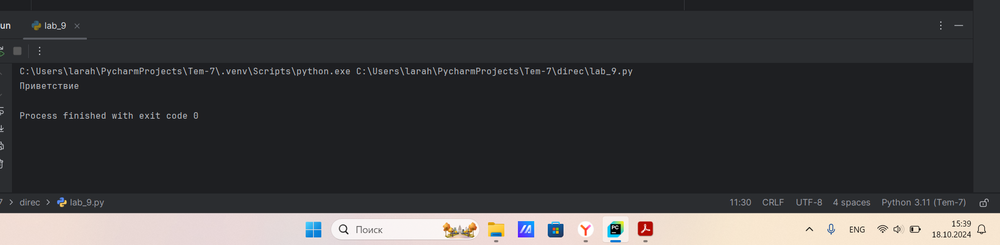
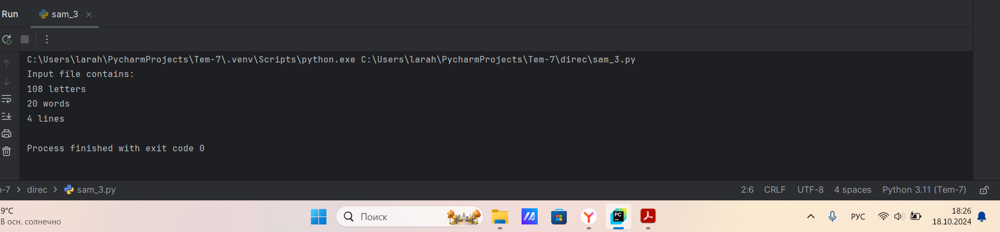
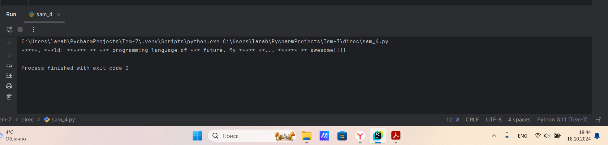

# Тема 7. Работа с файлами (ввод, вывод)
Отчет по Теме #7 выполнил(а):
- Алексеенко Валерия Олеговна
- ИВТ-22-1

| Задание | Лаб_раб | Сам_раб |
| ------ | ------ | ------ |
| Задание 1 | + | + |
| Задание 2 | + | + |
| Задание 3 | + | + |
| Задание 4 | + | + |
| Задание 5 | + | + |
| Задание 6 | + |  |
| Задание 7 | + |  |
| Задание 8 | + |  |
| Задание 9 | + |  |
| Задание 10 | + |  |

знак "+" - задание выполнено; знак "-" - задание не выполнено;

Работу проверили:
- к.э.н., доцент Панов М.А.

## Лабораторная работа №1
### Составьте текстовый файл и положите его в одну директорию  с  программой на Python. Текстовый файл должен состоять минимум из  двух строк.

### Результат.


## Выводы

В данном задании был создан текстовый файл text.txt с двумя строками представленными в рузультате изображением, текстовый файл находится в одной дирикторией с программой на Python.

## Лабораторная работа №2
### Напишите программу, которая выведет только первую строку из  вашего файла, при этом используйте конструкцию open()/close().

```python
f = open('text.txt', 'r')
print(f.readline())
f.close()
```
### Результат.


## Выводы

В данной программе выводится первая строка из текстового файла с использованием конструкции open()/close().

## Лабораторная работа №3
### Напишите программу, которая выведет все строки  вашего файла в массиве, при этом используйте конструкцию open()/close().

```python
f = open('text.txt', 'r')
print(f.readlines())
f.close()
```
### Результат.


## Выводы

В данной программе выводятся все строки в массиве из текстового файла с использованием конструкции open()/close().

## Лабораторная работа №4
### Напишите программу, которая выведет все строки из вашего файла  массиве, при  используйте конструкцию with opеn().

```python
with open('text.txt') as f:
    print(f.readline())
```
### Результат.


## Выводы

В данной программе выводятся все строки в массиве из текстового файла с использованием конструкции with opеn().  

## Лабораторная работа №5
### Напишите программу, которая выведет каждую строку  вашего  файла отдельно, при этом используйте конструкцию with open().

```python
with open('text.txt') as f:
    for line in f:
        print(line)
```
### Результат.


## Выводы

В данной программе выводится каждая строка из текстового файла с использованием конструкции with opеn().  

## Лабораторная работа №6
### Напишите программу, которая будет добавлять новую строку в ваш  файл, а потом выведет полученный файл в консоль. Вывод можно осушествлять любым способом. Обязательно проверьте сам файл чтобы изменения в нем тоже отображались.

```python
with open('text.txt', 'a+') as f:
    f.write('\nIm additional line')
with open('text.txt', 'r') as f:
    result = f.readlines()
    print(result)
```
### Результат.


## Выводы

В данной программе добавляется новая строка в файл, а потом выводится полученный файл в консоль.  

## Лабораторная работа №7
### Напишите программу, которая перепишет всю информацию, которая  была у вас в файле до этого, например напишет любые данные из  произвольно вами составленного списка. Также не забудьте проверить  что измененная вами информация сохранилась в файле

```python
lines = ['one', 'two', 'three']
with open('text.txt', 'w') as f:
    for line in lines:
        f.write('\nCycle run ' + line)
    print('Done!')
```
### Результат.


## Выводы

В данной программе переписывается вся информация в файле, а потом выводится слово 'Done!' при завершении программы. 

## Лабораторная работа №8
### Выберите любую папку на своем компъютере, имеюшую вложенные  директории. Выведите на печать в терминал eе содержимое, как  всех  подкаталогов при помощи функции print_docs(directory).

```python
import os

def print_docs(direcrory):
    all_files = os.walk(direcrory)
    for catalog in all_files:
        print(f'Папка {catalog[0]} содержит:')
        print(f'Директории {", ".join([folder for folder in catalog[1]])}')
        print(f'Файлы: {", ".join([file for file in catalog[2]])}')
        print('-' * 40)
print_docs('C:/Users/larah/PycharmProjects/Tem-7/direc')
```
### Результат.


## Выводы

В данной программе выбрана папка direc имеюшяя вложенные  директории, выводитсч на печать ее содержимое при помощи функции print_docs(directory).

## Лабораторная работа №9
### Документ «input.txt» содержит следующий текст:  
### Приветствие  Спасибо  
### Извините  
### Пожалуйста  
### До свидания 
### Ты готов?   
### Как дела?  
### С днем рождения! 
### Удача!  
### Я тебя люблю  
### Требуется реализовать функцию, которая выводит слово, имеющее  максимальную длину (или список слов, если таковых несколько). Проверьте работоспособность программы на своем наборе данных

```python
def longest_words(file):
    with open(file, encoding='utf-8') as f:
        words = f.read().split()
        max_length = len(max(words, key=len))
        for word in words:
            if len(word) == max_length:
                sought_words = word
        if len(sought_words) == 1:
            return sought_words[0]
        return sought_words
print(longest_words('text.txt'))
```
### Результат.


## Выводы

В данной программе реализуется функция, которая выводит слово, имеющее  максимальную длину.

## Лабораторная работа №10
### Требуется создать сsv-файл «rows_300.csv» co следующими  столбцами:
### N номер по порядку (от 1 до 300);  
### Секунда — текущая секунда на вашем ПК;
### Микросекунда — текущая миллисекунда на часах.
### Для наглядности на каждой итерации цикла искусственно приостанавливайте скрипт на О,01 секунды.

```python
import csv
import datetime
import time

with open('rows_300.csv', 'w', encoding='utf-8', newline='') as f:
    writer = csv.writer(f)
    writer.writerow(['№', 'Секунда', 'Микросекунда'])
    for line in range(1, 301):
        writer.writerow([line, datetime.datetime.now().second, datetime.datetime.now().microsecond])
        time.sleep(0.01)
```
### Результат.


## Выводы

В данной программе создается файл сsv-файл «rows_300.csv» co столбцами: N номер по порядку (от 1 до 300); Секунда — текущая секунда на вашем ПК; Микросекунда — текущая миллисекунда на часах.

## Самостоятельная работа №1
### Найдите в интернете любую статью (объем статьи не менее 200  слов), скопируйте ее содержимое в файл и напишите программу  которая считает количество слов в текстовом файле и определит  самое часто встречающееся слово. Результатом выполнения задачи  будет: скриншот файла со статьей, листинг кода, и вывод в консоль, в котором будет указана вся необходимая информация 

```python
from collections import Counter
import re

with open('statya.txt', 'r') as file:
    text = file.read()

text = re.sub(r'[^\w\s]', '', text)
words = text.split()
word_count = Counter(words)
most_common_word = word_count.most_common(1)[0]

print(f'Количество слов в тексте: {len(words)}')
print(f'Самое часто встречающееся слово: "{most_common_word[0]}" ({most_common_word[1]} вхождений)')
```
### Результат.


## Выводы

Данная программа считает количество слов в текстовом файле и определит самое часто встречающееся слово.

## Самостоятельная работа №2
### У вас появилась потребность в ведении книги расходов, посмотрев  все существующие варианты вы пришли к выводу что вас ничего не  устраивает и нужно все делать самому. Напишите программу для учета расходов. Программа должна позволять вводить информацию  о расходах, сохранять ее в файл и выводить существующие данные в  консоль. Ввод информации происходит через консоль. Результатом  выполнения задачи будет: скриншот файла с учетом расходов  листинг кода, и вывод в консоль, с демонстрацией  работоспособности программы.

```python
def input_expenses():
    date = input("Введите дату: ")
    amount = input("Введите сумму расхода: ")
    return f"{date}, {amount}\n"

def save_expenses(expenses):
    with open("expenses.txt", "a") as file:
        file.write(expenses)

def read_expenses():
    with open("expenses.txt", "r") as file:
        for line in file:
            print(line)
while True:
    command = input("Введите '+', чтобы добавить расход, или '=', чтобы посмотреть информацию о расходах: ")
    if command == '+':
        expenses = input_expenses()
        save_expenses(expenses)
    elif command == '=':(
        read_expenses())
    else:
        print("Неверная команда. Попробуйте снова.")
```
### Результат.


## Выводы

Данная программа создана для учета расходов. В начале программа дает выбор добавить расход или посмотреть их на консоли. При добавлении расхода она принимает на вход дату и сумму расхода. Всю введенную информацию она сохраняет ее в файл и выводит данные в  консоль.

## Самостоятельная работа №3
### Имеется файл imput.txt с текстом на латинице. Напишите программу  которая выводит следующую статистику по тексту: количество букв  латинского алфавита; число слов; число строк
### Текст в файле:
### Beautiful is better than ugly.
### Explicit is better than implicit.
### Simple is better than complex.
### Complex is better than complicated.
### Ожидаемый результат  Input file contains:
### 108 letters
### 20 words
### 4 lines

```python
with open("input.txt", "r") as file:
     text = file.read()

letters = sum(1 for char in text if char.isalpha())
words = len(text.split())
lines = text.count("\n") + 1

print("Input file contains:")
print(f"{letters} letters")
print(f"{words} words")
print(f"{lines} lines")
```
### Результат.


## Выводы

В данной программе выводится статистика содержимого в фале а именно: количество букв  латинского алфавита; число слов; число строк.

## Самостоятельная работа №4
### Напишите программу на Python, которая получает на вход предложение  выводит его в терминал, заменяя все запрешенные слова  звездочками * (количество звездочек равно количеству букв в  слове). Запрещенные слова, разделенные символом пробела  хранятся в текстовом файле input.txt. Все слова в этом файле  записаны в нижнем регистре. Программа должна заменить  запрещенные слова, где бы они ни встречались, даже в середине  другого слова. Замена производится независимо от регистра: если файл input.txt содержит запрещенное слово exam, то слова exam,  Exam, ExaM, ЕХАМ и  ехАm должны быть заменены на ****.
### Запрещенные слова:  hello email python the exam wor is
###  Предложение для проверки:
### Hello, world! Python IS the programming language of thE future.
###  Мy  EMAIL is...
### PYTHON is awesome!!!!
### Ожидаемый результат:
### *****, ***ld! ****** ** *** programming language of  *** future. Му ***** **....
### ****** ** awesome!!!! 

```python
def fanc(sentence, banned):
    result = []
    for word in sentence.split():
        if word.lower() in banned:
            result.append("*" * len(word))
        else:
            result.append(word)
    return " ".join(result)

with open("input2.txt", "r") as file:
    banned = file.read().split()
sentence = "Hello, world! Python IS the programming language of thE future. Мy EMAIL is... PYTHON is awesome!!!!"
result = fanc(sentence, banned)
print(result)
```
### Результат.


## Выводы

Данная программа получает на вход предложение и выводит его в терминал, заменяя все запрешенные слова  звездочками *. Запрещенные слова, разделенные символом пробела  хранятся в текстовом файле input.txt. Все слова в этом файле записаны в нижнем регистре. Программа должна заменить  запрещенные слова, где бы они ни встречались, даже в середине  другого слова. Замена производится независимо от регистра

## Самостоятельная работа №5
### Самостоятельно придумайте и решите задачу которая будет  взаимодействовать с текстовым файлом.

```python
with open('file.txt', 'r') as file:
    text = file.read()
nums = text.split()
nums = [int(num) for num in nums]
sum = 0
for i in nums:
    sum += i
print(f"Сумма цифр равна: {sum}")
```
### Результат.


## Выводы

В данной программе считается сумма цифр, содержащяяся в фале file.txt.

## Общие выводы по теме
В данной теме я изучила работу с файлами (ввод, вывод), которые являются основой программирования на Python. Они позволяют выполнять и создавать логически сложные программы, обрабатывать данные и управлять потоком выполнения, что является основным для написания кода.
