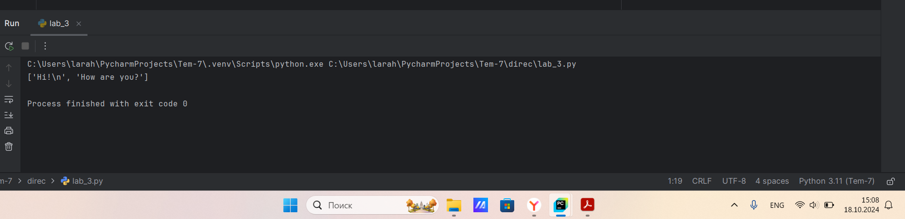
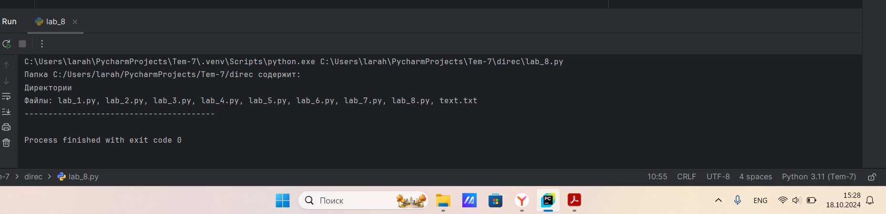

# Тема 1. Введение в Python
Отчет по Теме #1 выполнил(а):
- Алексеенко Валерия Олеговна
- ИВТ-22-1

| Задание | Лаб_раб |
| ------ | ------ |
| Задание 1 | + |
| Задание 2 | + |
| Задание 3 | + |
| Задание 4 | + |
| Задание 5 | + |
| Задание 6 | + |
| Задание 7 | + |
| Задание 8 | + |
| Задание 9 | + |
| Задание 10 | + |
| Задание 11 | + |
| Задание 12 | + |
| Задание 13 | + |
| Задание 14 | + |
| Задание 15 | + |

знак "+" - задание выполнено; знак "-" - задание не выполнено;

Работу проверили:
- к.э.н., доцент Панов М.А.

## Лабораторная работа №1

### Установка

## Лабораторная работа №2

### Настройка

## Лабораторная работа №3

### Создание нового репозитория

## Лабораторная работа №4

### Подготовка файлов

## Лабораторная работа №5

### Фиксация изменений

## Лабораторная работа №6

### Подключение к удаленному репозиторию

## Лабораторная работа №7

### Ветвление

## Лабораторная работа №8

### Особенности применения "Фетч"

## Лабораторная работа №9

### Удаление файлов, веток, локальных и удалённых репозиториев

## Лабораторная работа №10

### Отслеживание изменений в коммитах

## Лабораторная работа №11

### Возвращение файла к предыдущему (определенному) состоянию

## Лабораторная работа №12

### Возвращение к предыдущему коммиту

## Лабораторная работа №13

### Исправление коммита

## Лабораторная работа №14

### Разрешение конфликтов при слиянии

## Лабораторная работа №15

### Настройка .gitignore

## Вывод по пройденой теме:
